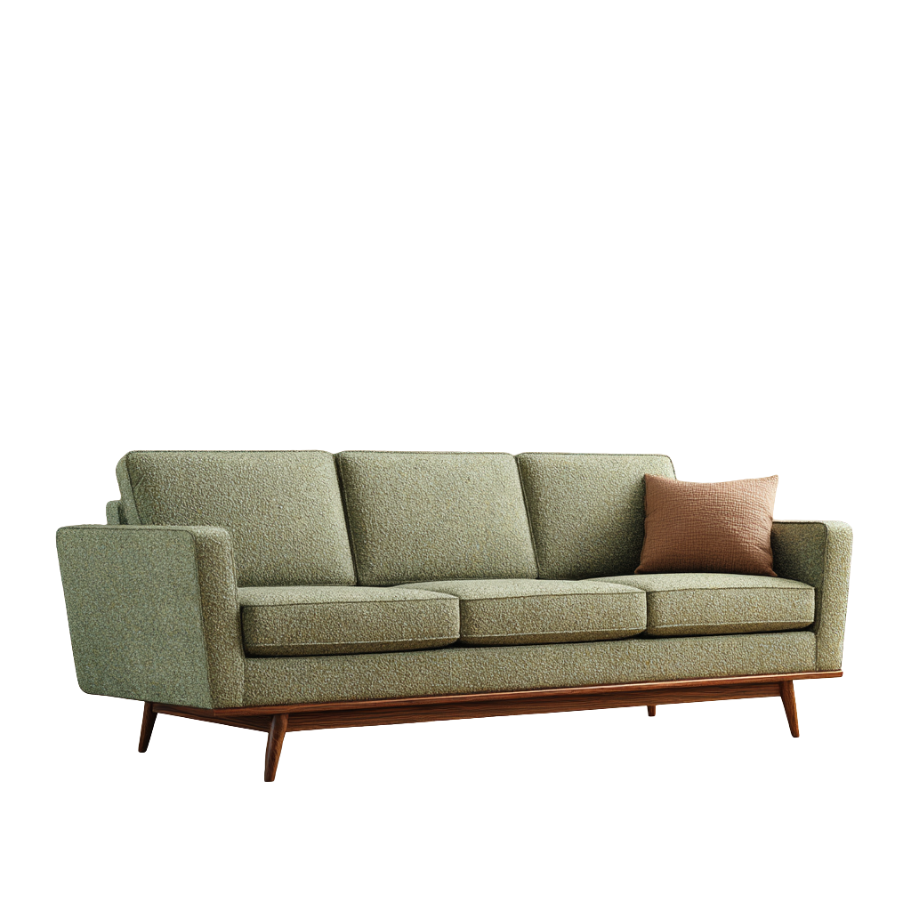
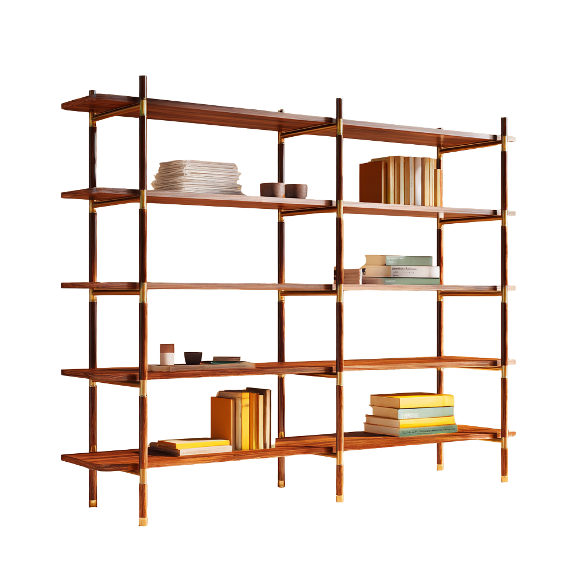
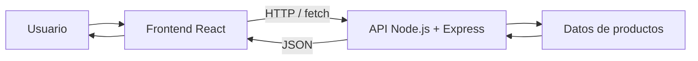

<div align="center">


# 🪑 E-commerce Mueblería Hermanos Jota

### Aplicación web Full Stack · React + Node.js + Express


**Proyecto académico desarrollado durante los Sprints 3 y 4.**

</div>

---

## 📖 Descripción

**Mueblería Hermanos Jota** es una aplicación web de e-commerce desarrollada con una arquitectura separada entre **frontend** y **backend**.

El sistema permite consultar un catálogo de muebles, visualizar el detalle de cada producto y gestionar un carrito de compras. La interfaz fue desarrollada con **React**, mientras que el backend utiliza **Node.js + Express** para exponer la información de productos mediante una API REST.

---

## 🖼️ Vista del catálogo

<p align="center">
  
  
  
</p>

> Las imágenes utilizadas forman parte de los recursos del propio proyecto.

---

## ✨ Funcionalidades principales

- 🛍️ Catálogo de productos
- 🔎 Visualización del detalle de cada producto
- 🛒 Carrito de compras
- ➕ Agregado de productos al carrito
- ➖ Modificación de cantidades
- 🗑️ Eliminación de productos y vaciado del carrito
- 🧭 Navegación entre las distintas secciones
- 📡 Consumo de API mediante `fetch`
- ⚠️ Manejo de estados de carga y error
- 🔗 Integración entre frontend y backend

---

## 🛠️ Tecnologías utilizadas

### Frontend

- **React 19**
- **JavaScript**
- **CSS**
- Fetch API
- React Scripts

### Backend

- **Node.js**
- **Express.js**
- **CORS**
- API REST

---

## 🏗️ Arquitectura

El proyecto está organizado en dos aplicaciones independientes:

```text
muebleria-hermanos-jota/
│
├── client/                 # Aplicación frontend en React
│   ├── public/
│   │   └── img/            # Imágenes y recursos visuales
│   ├── src/
│   │   ├── components/
│   │   ├── App.js
│   │   └── App.css
│   └── package.json
│
├── backend/                # API REST en Node.js + Express
│   ├── data/
│   ├── middlewares/
│   ├── routes/
│   ├── server.js
│   └── package.json
│
└── README.md
```

### Flujo de comunicación



---

## 🚀 Instalación y ejecución

### Requisitos previos

Es necesario contar con:

- **Node.js**
- **npm**

### 1. Clonar el repositorio

```bash
git clone https://github.com/gianellaromero/muebleria-hermanos-jota.git
cd muebleria-hermanos-jota
```

### 2. Iniciar el backend

```bash
cd backend
npm install
npm start
```

El backend se ejecuta en:

```text
http://localhost:3001
```

Endpoint principal de productos:

```text
http://localhost:3001/api/productos
```

### 3. Iniciar el frontend

En una nueva terminal:

```bash
cd client
npm install
npm start
```

El frontend se ejecuta en:

```text
http://localhost:3000
```

> [!IMPORTANT]
> El backend debe estar activo para que el frontend pueda obtener la información de los productos desde la API.

---

## 🔗 Integración Frontend / Backend

El frontend realiza solicitudes HTTP al backend mediante `fetch`.

La API expone los productos a través del endpoint:

```http
GET /api/productos
```

Express procesa la solicitud y devuelve los datos en formato JSON. React utiliza esa respuesta para renderizar dinámicamente el catálogo y las vistas asociadas a los productos.

---

## 💡 Decisiones de desarrollo

La separación entre **frontend y backend** permite mantener responsabilidades claras dentro del proyecto.

- **React** se utiliza para construir la interfaz mediante componentes reutilizables y manejar los diferentes estados de la aplicación.
- **Node.js + Express** conforman la API encargada de centralizar y entregar los datos de productos.
- **CORS** permite la comunicación entre el frontend, ejecutado en el puerto `3000`, y el backend, ejecutado en el puerto `3001`.
- La organización por componentes facilita el mantenimiento del catálogo, el detalle de productos, la navegación, el formulario de contacto y el carrito.

---

## 📂 Componentes principales del frontend

Entre los componentes utilizados se encuentran:

```text
Cart.jsx
ContactForm.jsx
Footer.jsx
Navbar.jsx
ProductCard.jsx
ProductDetail.jsx
ProductList.jsx
```

Esto permite mantener la interfaz dividida en responsabilidades específicas y reutilizables.

---

## 👥 Equipo

| Integrante |
|---|
| Gianella Romero |
| Daiana Elizabeth Villagra |
| Francisco Garcia Sorrenti |
| Khiara Razzolini |
| Joaquín González |

---

## 📌 Estado del proyecto

| Etapa | Objetivo | Estado |
|---|---|---|
| Sprint 3 | Desarrollo de API backend | ✅ Completado |
| Sprint 4 | Integración Frontend / Backend | ✅ Completado |
| Entrega final | Integración y ajustes finales | ✅ Completado |

---

## 🎓 Proyecto académico

Proyecto desarrollado con fines académicos dentro de la formación **Full Stack – Santander / ITBA**, aplicando conceptos de:

- Desarrollo web con React
- Arquitectura cliente-servidor
- APIs REST
- Node.js y Express
- Integración frontend-backend
- Organización de código mediante componentes

---

<div align="center">

### 🪑 Mueblería Hermanos Jota

**React · JavaScript · Node.js · Express**

Proyecto académico · 2026

</div>
